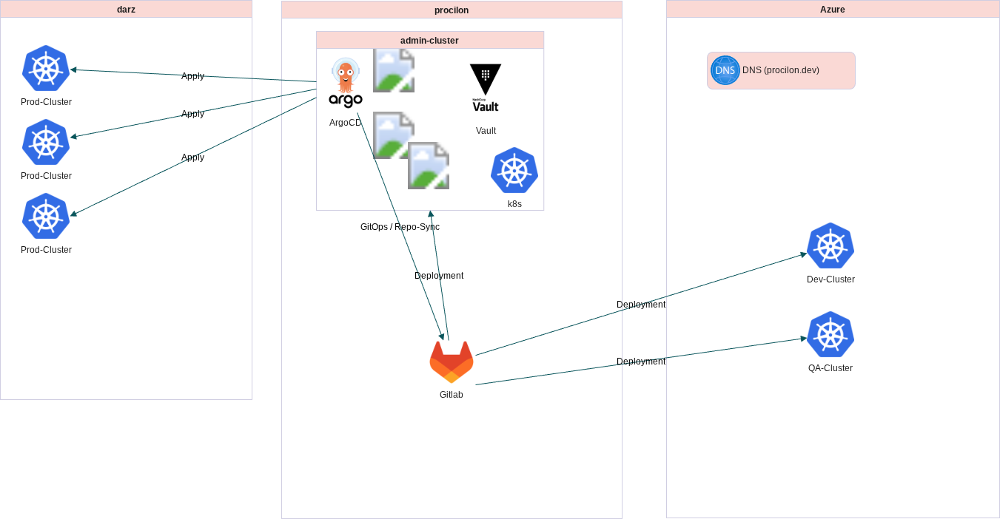
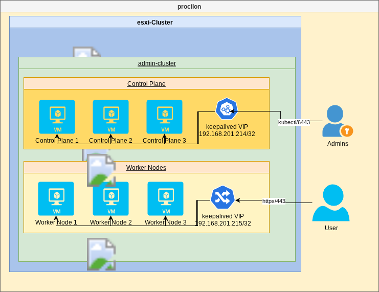

<!-- confluence-page-id: 1044512769 -->
<!-- confluence-space-key: CLO -->

[[_TOC_]]

## Voraussetzungen

* IAC - Alles als Code
* Anbindung an Entra ID
* Deployment über CI/CD Gitlab
* Argo CD - Deployed in Darz
* Monitoring, Logging, Alerting
* Backup der PVCs/Datenbanken

## Festlegungen

* Die Installation des Clusters erfolgt im bestehenden esxi-Cluster
* Die VMs liegen in einer DMZ, damit Externe MA Zugriff per SSH erhalten (zur Installation)
* Zur Installation des Clusters wird rke2 eingesetzt
* Wir wollen wenn möglich den vSphere-Storage nutzen, benötigen dazu aber API-Zugriff
  * Klärung erfolgt mit Steffen
* Wir wollen wenn möglich VMs selbst provisonieren, benötigen dazu aber API-Zugriff und die maximal nutzbaren Ressourcen im esxi müssen eingeschränkt werden, damit wir keine Produktiv-Systeme beeinträchtigen
  * Klärung erfolgt mit Steffen
* Es wird die bestehende DNS-Zohne “procilon.dev” genutzt
  * Wir nutzen eine Subdomain “\*.admin-cluster.procilon.dev”
* Als Loadbalancer vor dem Cluster wird eine Lösung mit keepalived genutzt
  * Dort wird eine IP-Adresse definiert (admin-cluster.procilon.dev löst auf diese auf), die auf 443 und 6443 lauscht und alle Anfragen an die IP-Adressen des Admin-Clusters schickt

## Hardware

* Ubuntu 24.04.3
* 4 vCPU
* 16GB RAM
* Storage 80GB
* Vorerst in DMZ da externe nicht in das Interne Netz dürfen.
* Hosts:
  * Control-Planes / Master-Nodes
    * prock8sadmc-01 - 192.168.201.141
    * prock8sadmc-02 - 192.168.201.142
    * prock8sadmc-03 - 192.168.201.143
  * Agents-Nodes / Worker-Nodes
    * prock8sadmc-04 - 192.168.201.144
    * prock8sadmc-05 - 192.168.201.145
    * prock8sadmc-06 - 192.168.201.146

## Schaubilder




## Mögliche Kubernetes Setups

* Rancher - Auf Rancher geeinigt
* Talos
* Kubespray
* Kubeadm
* K3S
* Openshift

### Rancher

Pro:

* Einfaches Setup (Docker, k3s/Helm)
* Wird von Darz genutzt
* GUI out of the box (Cluster, Workloads, Monitoring, RBAC etc.)
* Einfaches K8s-Upgrade
* Cluster Setup über Terraform möglich
* Multi-Cluster-Management out of the box

Contra:

* Extra VM erforderlich
* Komplexer, wenn nur ein kleiner Cluster gebraucht wird (Overhead)
* Abhängigkeit von Rancher-Ökosystem

### Talos

Pro:

* Sehr sicher (immutable OS, extrem kleine Angriffsfläche)
* Konfiguration deklarativ über YAML
* Einfaches Lifecycle-Management (Upgrade, Patches, Reprovisioning)
* Guter Fit für GitOps-Ansätze

Contra:

* Images müssen von Admins (z. B. vSphere) bereitgestellt werden
* Zugriff nur über talosctl (kein klassisches SSH) Debugging?
* Noch nicht so weit verbreitet → kleineres Ökosystem, weniger Erfahrungsberichte

### Kubespray

Pro:

* Deployment über Ansible → flexibel und automatisierbar
* Unterstützt viele Cloud- und On-Prem-Umgebungen
* Open Source, ohne Vendor Lock-in
* Sehr gute Kontrolle über Cluster-Topologie und Add-ons

Contra:

* Kubernetes-Updates müssen manuell geplant und getestet werden
* Höherer Wartungsaufwand im Vergleich zu Managed Services oder Talos
* Kein GUI/Management-Layer von Haus aus

### Kubeadm

Pro:

* Offizielles Kubernetes-Projekt → sehr nah am Standard
* Hohe Flexibilität, volle Kontrolle über Setup
* Gut zum Lernen („der Standard-Weg“)
* Weit verbreitet, große Community

Contra:

* „The hard way“ → viel Handarbeit bei Setup und Maintenance
* Upgrades fehleranfällig, erfordern Know-how
* Kein integriertes Lifecycle- oder Cluster-Management

### K3S

Pro:
* Leichtgewichtige K8s-Distribution, optimiert für Edge und IoT
* Sehr geringe Anforderungen (läuft auch auf Raspberry Pi)
* Einfache Installation & Updates
* Große Community, Rancher/ SUSE Support

Contra:

* Weniger Features out of the box als Voll-Kubernetes
* Teilweise Abweichungen vom Standard (z. B. SQLite als Default-DB)
* Eher Edge/Dev als Enterprise

### Openshift (RedHat)

Pro:
* Enterprise-ready (Security, Support, integrierte CI/CD, Operator-Framework)
* Viele Features out of the box (Monitoring, Logging, Service Mesh, Registry, RBAC)
* Unterstützt Hybrid-Cloud-Setups
* Starke Red Hat/IBM-Unterstützung

Contra:
* Lizenzkosten (kommerziell)
* Höhere Hardware-Anforderungen
* Komplexes Ökosystem, nicht für kleine Cluster gedacht

## Lokale Installation

### Lokal VMs erstellen

Um das interne Admin-Cluster lokal zu testen, werden 6 Ubuntu 24.04 VMs benötigt, drei Master-Nodes, drei Worker-Nodes.

### Repository klonen

```bash
git clone https://gitlab.procilon.de/cloud-and-infrastructure/admin-cluster/internal-admin-cluster/
cd internal-admin-cluster
```

### Umgebungsvariablen setzen

Die Datei `.envrc_template` anpassen und die darin befindlichen Umgebungsvariablen exportieren (z.B. mit mise, direnv o.Ä.).

### Inventory erstellen

Neues inventory, z. B. `segu_inventory.yml` erstellen und die IP-Adressen der erstellten VMs eintragen.

```yaml
all:
  children:
    rke2_cluster:
      children:
        rke2_servers:
          hosts:
            rke2-master-01:
              ansible_host: 172.8.201.141
            rke2-master-02:
              ansible_host: 172.8.201.142
            rke2-master-03:
              ansible_host: 172.8.201.143
        rke2_agents:
          hosts:
            rke2-worker-01:
              ansible_host: 172.8.201.144
            rke2-worker-02:
              ansible_host: 172.8.201.145
            rke2-worker-03:
              ansible_host: 172.8.201.146
```

### Cluster deployen

Möchte man das Setup lokal ausführen, muss dem Ansible-Playbook noch die Variable `kube_api_url` mit dem Wert der lokalen URL für die API mitgegeben werden. Dies kann eine intern genutzte IP-Adresse sein, kombiniert mit "nip.io".

```bash
> ansible-playbook -i inventory.yml -b deploy-keepalived.yml
> ansible-playbook --become -i inventory.yaml deploy-rke2.yml --ask-vault-pass --diff -e "kube_api_url=api.172.16.0.120.nip.io"
```

### Cluster-Zugang herstellen

Nach erfolgreichem Deployment kann die KUBECONFIG geladen werden.

```bash
ansible -b -i segu_inventory.yaml rke2-server-01 -m fetch -a 'src=/etc/rancher/rke2/rke2.yaml dest=./ flat=true'

# datei liegt unter rke2.yaml

export KUBECONFIG=rke2.yaml
```

### ArgoCD und weitere Anwendungen deployen

Um im Anschluss die restliche Cluster-Konfiguration durchzuführen, müssen die Schritte im "deploy"-Job in der `.gitlab-ci.yml` nacheinander ausgeführt werden.

Zuerst muss jedoch in der Datei `k8s/initial/argocd/values-local.yaml` die `server.host`-Variable auf eine intern genutzte IP-Adresse gesetzt werden, kombiniert mit "nip.io".

Dann müssen zwei Umgebungs-Variablen gesetzt werden:

- `VALUES_FILE` - der Name der Helm-Values file, in dem die Konfiguration für die Lokale Umgebung steht
- `GITLAB_ACCESS_TOKEN` - ein selbst erstellter Personal Access Token, der das Recht hat, dieses Repository zu clonen

Dann müssen die Schritte im "deploy"-Job in der `.gitlab-ci.yml` ausgeführt werden.

Zuletzt wird die "App of Apps" ArgoCD-Application installiert, die die restlichen Anwendungen installiert:

```bash
kubectl apply -f k8s/initial/app-of-apps.yaml
```

Ist `gitlab-ci-local` installiert, kann stattdessen folgender Befehl genutzt werden:

```bash
gitlab-ci-local deploy --container-executable podman --variables-file .gitlab-ci-local-variables.yml
```

Zuletzt wird die "App of Apps" ArgoCD-Application installiert, die die restlichen Anwendungen installiert:

```bash
kubectl apply -f k8s/initial/app-of-apps.yaml
```

## Produktive Installation

### VMs

Die VMs des internen Admin-Clusters wurden uns durch Steffen zur Verfügung gestellt und werden hier nicht weiter betrachtet.

### Repository klonen

```bash
git clone https://gitlab.procilon.de/cloud-and-infrastructure/admin-cluster/internal-admin-cluster/
cd internal-admin-cluster
```

### Umgebungsvariablen setzen

Die Datei `.envrc_template` anpassen und die darin befindlichen Umgebungsvariablen exportieren (z.B. mit mise, direnv o.Ä.).

### Cluster deployen

Die Konfiguration des Clusters ist in der Datei `group_vars/all.yml` zu finden.

```bash
> ansible-playbook -i inventory.yml -b deploy-keepalived.yml
> ansible-playbook --become -i inventory.yml deploy-rke2.yml --ask-vault-pass --diff
```

### Cluster-Zugang herstellen

Nach erfolgreichem Deployment kann die KUBECONFIG geladen werden.

```bash
ansible -b -i inventory.yaml rke2-server-01 -m fetch -a 'src=/etc/rancher/rke2/rke2.yaml dest=./prod.yaml flat=true'

# datei liegt unter prod.yaml

export KUBECONFIG=prod.yaml
```

## Air-Gapped Installation

Um die Installation möglichst unabhängig von Procilon-externen Diensten (z.B. Github, Azure) zu machen, wird das Cluster "air-gapped" installiert, also ohne Zugriff auf Resourcen aus dem Internet.

Dazu wurde im Artifactory ein Mirror eingerichtet:

- Quell-URL: https://github.com/rancher/rke2/releases/
- Umgeschriebene URL: https://repo.procilon.de/artifactory/github.com/rancher/rke2/releases/

Das rke2-Installationsscript ([https://get.rke2.io/](https://get.rke2.io/)) wurde als Datei in die rke2-Ansible-Rolle gelegt und wird mit der Umgebungsvariable `INSTALL_RKE2_ARTIFACT_PATH: "/root/rke2-install-files/"` aufgerufen.

Die Installationsdateien werden vorher per Ansible-Task in den Ordner `/root/rke2-install-files/` gelegt und von dort während der Installation konsumiert. So ist kein Zugriff auf Github während der Installation notwendig.

## Registry-Konfiguration

Images, welche aus dem Dockerhub geladen werden sollen, werden stattdessen aus dem Artifactory geladen.
Dazu wird eine `registries.yaml`-[Konfiguration](https://docs.rke2.io/install/private_registry) im rke2 erstellt und  per Ansible ausgerollt.

```yaml
mirrors:
  docker.io:
    endpoint:
      - "https://repo.procilon.de"
    rewrite:
      "(.*)": "mirror/$1"
```

## ArgoCD

Argo CD wird automatisch über die Gitlab-CI-Pipeline bereitgestellt.
Dazu wird der Argo CD Operator verwendet.
Zusätzlich wird das Manifest k8s/initial/app-of-apps.yaml deployt, um die Grundkonfiguration von Argo CD zu initialisieren.

Weitere Applikationen können hinzugefügt werden, indem entsprechende Manifeste im Verzeichnis k8s/cluster-configuration/ abgelegt werden.

### ArgoCD Web-UI

```bash
# Admin-Passwort abrufen
kubectl -n argocd get secret argocd-initial-admin-secret -o jsonpath="{.data.password}" | base64 -d
```

ArgoCD UI: [https://argocd.internal-admin.procilon.dev](https://argocd.internal-admin.procilon.dev)

## Ingress Controller

Der RKE2 Ingress Controller (nginx) wird mittels HelmChartConfig im rke2 konfiguriert und diese per Ansible ausgerollt.

### Features

- **LoadBalancer**: Mit kube-vip IP `192.168.201.215`
- **High Availability**: 2 Replicas mit Pod Anti-Affinity
- **Default IngressClass**: `nginx`

### Konfiguration

```bash
# HelmChartConfig anpassen:
vim roles/rke2/templates/rke2-ingress-nginx-config.yaml.j2

# Ausrollen
ansible-playbook -ugumprich --become -i inventory.yml deploy-rke2.yml --diff --tags helmcharts
# Status prüfen
kubectl get pods -n kube-system -l app.kubernetes.io/name=ingress-nginx
```

### Beispiel Ingress

```yaml
apiVersion: networking.k8s.io/v1
kind: Ingress
metadata:
  name: argocd-server-ingress
  namespace: argocd
spec:
  ingressClassName: nginx
  rules:
    - host: argocd.softxpert.duckdns.org
      http:
        paths:
          - path: /
            pathType: Prefix
            backend:
              service:
                name: argocd-server
                port:
                  number: 80
```

## Registry-Konfiguration

Images werden standardmäßig aus dem Artifactory geladen.
Dazu wird eine `registries.yaml`-[Konfiguration](https://docs.rke2.io/install/private_registry) im rke2 erstellt und  per Ansible ausgerollt.

### Standard-Konfiguration (Artifactory Mirror)

```yaml
mirrors:
  docker.io:
    endpoint:
      - "https://repo.procilon.de"
    rewrite:
      "(.*)": "mirror/$1"
```

### Upstream Docker Registry verwenden

Um die Docker-Images direkt vom offiziellen Docker Hub zu laden, kann die Variable `use_upstream_docker_registry` auf `true` gesetzt werden:

**Variablen-Konfiguration:**
- **Variable:** `use_upstream_docker_registry`
- **Standardwert:** `false` (nutzt Procilon Artifactory Mirror)
- **Definiert in:** `roles/rke2/defaults/main.yml und group_vars/all.yml`

**Verwendung:**

```bash
# Im group_vars/all.yml setzen:
use_upstream_docker_registry: true

# Oder als Extra-Variable beim Ansible-Aufruf:
ansible-playbook --become -i inventory.yml deploy-rke2.yml -e "use_upstream_docker_registry=true"
```

**Resultierende Konfiguration:**

```yaml
mirrors:
  docker.io:
    endpoint:
      - "https://registry-1.docker.io"
```

**Anwendungsfälle:**
- **false** (Standard): Nutzt Procilon Artifactory als Mirror - empfohlen für Produktiv-Umgebungen
- **true**: Direkter Zugriff auf Docker Hub - nützlich für Test-Umgebungen oder wenn der Artifactory nicht verfügbar ist


## Cilium-Konfiguration

Cilium (nicht die Policies!) wird mittels HelmChartConfig im rke2 konfiguriert und diese per Ansible ausgerollt.

```
# HelmChartConfig anpassen:
vim roles/rke2/templates/rke2-cilium-config.yaml.j2

# Ausrollen
ansible-playbook -ugumprich --become -i inventory.yml deploy-rke2.yml --diff --tags helmcharts
```

## Upgrades

Zum Aktualisieren des Clusters wird der [System Update Controller](https://github.com/rancher/system-upgrade-controller/) eingesetzt.

Um die Version des Clusters zu aktualisieren, muss in der Datei `k8s/apps/system-upgrade-controller/templates/upgrade.plan.yaml` `.spec.version` für den `server-plan` und den `agent-plan` angepasst werden und das Manifest applied werden. Im Anschluss aktualisiert der Controller selbstständig die Nodes nacheinander.
